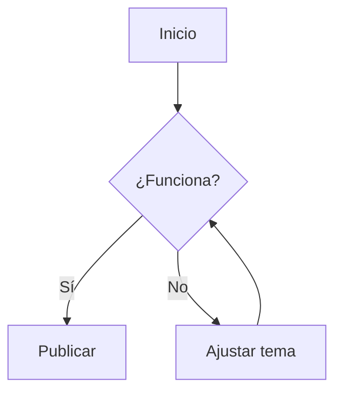

# Nota de prueba de features

Esta nota sirve para comprobar visualmente cómo se renderiza cada elemento de Markdown/Obsidian una vez publicado en Quartz. Bórrala o pásala a `draft: true` cuando termines de ajustar el tema.

## Texto básico

Un párrafo normal con **negrita**, _cursiva_, ~~tachado~~ y `código inline`. También un [enlace externo](https://quartz.jzhao.xyz) y un [[index|enlace interno con alias]].

> Esto es una cita simple (blockquote).

## Callouts / admonitions

> [!note]
> Esto es un callout de tipo nota.

> [!warning]
> Esto es un callout de advertencia.

> [!tip]
> Esto es un callout de consejo/tip.

> [!danger]
> Esto es un callout de peligro/error crítico.

## Wikilinks y transclusión

Enlace normal a otra nota: [[index]]

Transclusión de una nota completa:

![[Bienvenida]]

Transclusión de un bloque específico:

![[Bienvenida#Sección de ejemplo]]

## Listas

### Lista simple

- Elemento uno
- Elemento dos
  - Sub-elemento
- Elemento tres

### Lista numerada

1. Primer paso
2. Segundo paso
3. Tercer paso

### Checklist

- [x] Tarea completada
- [ ] Tarea pendiente

## Tabla

| Feature   | Estado | Notas              |
| --------- | ------ | ------------------ |
| Wikilinks | ✅     | Funciona con alias |
| Callouts  | ✅     | Ver tipos arriba   |
| Mermaid   | 🔄     | Probar abajo       |
| LaTeX     | 🔄     | Probar abajo       |

## Código

Código inline: `const x = 42;`

Bloque de código con syntax highlighting:

```javascript
function saludo(nombre) {
  return `Hola, ${nombre}!`
}

console.log(saludo("equipo"))
```

```python
def saludo(nombre: str) -> str:
    return f"Hola, {nombre}!"
```

## Imagen / adjunto

![[imagen-de-prueba.png]]

## LaTeX

Fórmula inline: $E = mc^2$

Fórmula en bloque:

$$
\sum_{i=1}^{n} i = \frac{n(n+1)}{2}
$$

## Diagrama Mermaid



## Footnotes

Esta frase tiene una nota al pie[^1] y otra más[^2].

[^1]: Primera nota al pie con una explicación breve.

[^2]: Segunda nota al pie, con **formato** dentro.

## Tags inline

Esta nota también prueba tags inline: #prueba #meta/testing

## Encabezados anidados (para probar la tabla de contenidos)

### Sub-sección A

Contenido de la sub-sección A.

### Sub-sección B

Contenido de la sub-sección B.

#### Sub-sub-sección B.1

Contenido más anidado, para ver hasta qué nivel muestra la TOC.

---

## Fin de la nota

Si todo lo de arriba se ve bien (colores, contraste, espaciados, dark/light mode), el tema está listo para el resto del contenido real.
